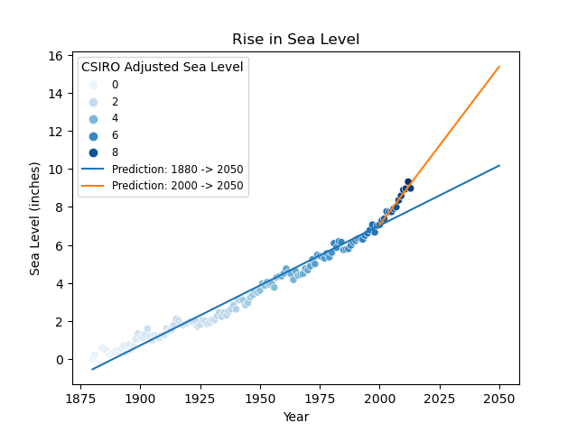

# Sea Level Predictor
Projeto criado a partir dos conhecimentos adquiridos no curso Data Analysis with Python - freeCodeCamp.

## Introdução
O projeto consiste na análise de um Dataset que contém dados sobre o nível do mar (em polegadas) ao longo dos anos. Utilizei a função **linregress** para calcular duas regressões lineares (utilizando dados, respectivamente, dos anos de 1880 a 2013 e 2000 a 2013) que serão responsáveis por prever o crescimento do nível do mar com o passar do tempo, até o ano 2050. Os dados e resultados das regressões lineares são plotados em um scatter plot (gráfico de dispersão) para melhor visualização.

## Gráfico

